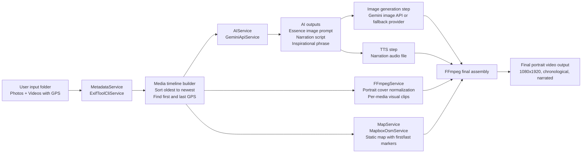

# Rooster's video creator

## Architecture plan (minimal one-way flow)



## Architecture & Design Decisions

- **One-way data movement only:** Ingest -> Extract Metadata -> Derive Timeline -> Generate Assets -> Compose Final Video. State passes linearly between discrete services, effectively eliminating race conditions and avoiding cyclic dependencies.
- **Service Interfaces:** All external APIs limit dependencies by using uniform internal service interfaces (`AiService`, `FFmpegService`, `MapService`, `MetadataService`). This makes mocking integrations for tests simple, or outright replacing FFmpeg CLI with native JNI (e.g. wrapper code) trivial. State passes gracefully to downstream calls without explicit tight coupling.
- **Pipeline Abstraction:** The `PipelineStep` interfaces form a strict series of execution tasks. Each step owns exactly one single responsibility constraint representing chronological output generation via processing logic isolated to its class structure. `VideoPipelineOrchestrator` runs them sequentially reporting real-time listener updates enabling seamless UI and CLI observability.
- **Tools Override Custom Solutions:** Heavy lifting is delegated to proven standalone tools inside service wrappers (ExifTool / Mapbox / FFmpeg) rather than writing custom unstable media parsers or rendering libraries.
- **Resource Cleanup / Error Recovery:** The system is explicitly designed for short-lived ephemeral process commands checking states incrementally vs. large continuous system threads.

## Pipeline Stages Definition

The project is structured under `edu.up.cg.pipeline` utilizing dedicated step classes that independently interact with the `PipelineContext` state:

### Step 01: Essence Image (`Step01EssenceImage`)
* **Receives:** Ordered media metadata wrapped via context state.
* **Does:** Evaluates the earliest geographical points and runs an AI prompt outlining the essence of the starting location.
* **Outputs:** Generates an evocative image-based vision prompt string (`01_essence_prompt.txt`) appended to pipeline context.

### Step 02: Narration & TTS Generation (`Step02NarrationTts`)
* **Receives:** Ordered points list containing dates, geo-coordinates, and context.
* **Does:** Prompts AI to construct chronologically tied phrasing mapping one sentence per coordinate. Invokes Google TTS stream creation.
* **Outputs:** A complete text script and multiple synchronized TTS voiceover files `.mp3` linked back to the step instance context.

### Step 03: Visual Timeline Creation (`Step03VisualTimeline`)
* **Receives:** Raw photos/videos alongside lengths defined via bounded audio `.mp3` sizes per scene.
* **Does:** Pre-renders all incoming media explicitly scaling/cropping padding into strict portrait aspect format via FFmpeg while looping their runtime (`-shortest`) precisely to map lengths of narrator voice track fragments.
* **Outputs:** Chronological and aligned visual & voice timeline clips merged into an uncompressed AV track called `03_timeline.mp4`.

### Step 04: Final Merge and Normalization (`Step04FinalMerge`)
* **Receives:** The unified timeline video (`03_timeline.mp4`).
* **Does:** Seamlessly copies encoding formats whilst injecting broadcast-level audio normalization metrics (`-af loudnorm` filter graph) into the video's embedded track. Validates compliance variables (LRA/TruePeak).
* **Outputs:** The complete loudness-normalized track `04_merged.mp4`.

### Step 05: Map Outro & Wrap-up (`Step05MapOutro`)
* **Receives:** `04_merged.mp4` timeline track and first/last detected geo-coordinates.
* **Does:** Asks Mapbox static layout endpoints for an overarching bounds map bridging the first & last detected positions. Queries AI for an inspirational close-out wrap phrase. Encodes the text directly drawn over the resulting map explicitly using stacked `drawtext` video filters.
* **Outputs:** Joins the prior normalized clip dynamically combining visuals for the final full-chain production `05_final_video.mp4`.

## Recommended tools for this exact project

- ExifTool: robust GPS/date extraction for mixed camera formats.
- FFmpeg: scaling, crop-to-cover portrait, concat, audio attach, loudness normalization.
- Gemini: script and phrase generation, plus first-image prompt generation.
- Mapbox Static API: deterministic map image with custom first/last pin styles.

## Optional upgrades (only if needed)

- Better timeline metadata fallback: ExifTool + Apache Tika MIME detection for rare files.
- Better speech quality: ElevenLabs or Azure Speech instead of basic/free TTS.
- Better loudness compliance: add explicit FFmpeg loudnorm two-pass to target YouTube-like levels.
- Better rendering throughput: keep FFmpeg operations as one consolidated filter graph when pipeline is stable.

### Run the project

From the project root, run:

```bash
./run.sh
```

### Example Usage

You can run the pipeline with multiple images to generate a narrated video with an outro map and a custom phrase overlay. Here is a simple example using three provided test images:

```bash
# Make sure to load your API keys into the environment first, for example:
# set -a && source .env.prod && set +a

mvn compile exec:java -Dexec.mainClass="edu.up.cg.Main" -Dexec.args="--out output-example bin/testcase/gdl2.jpg bin/testcase/cdmx.jpg bin/testcase/img-santiago.jpg"
```
