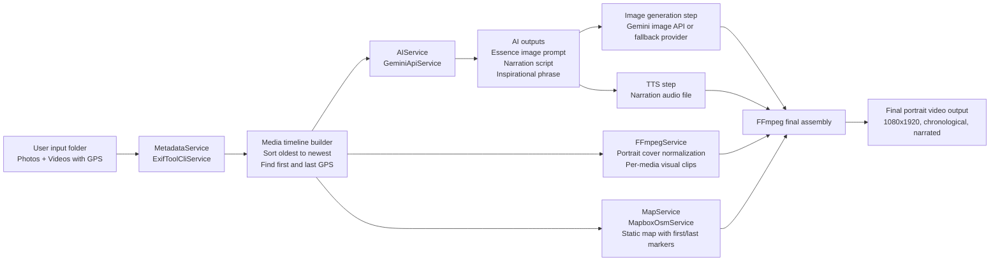

# Rooster's video creator

## Architecture plan (minimal one-way flow)



## Architecture & Design Decisions

- **One-way data movement only:** Ingest -> Extract Metadata -> Derive Timeline -> Generate Assets -> Compose Final Video. State passes linearly between discrete services, effectively eliminating race conditions and avoiding cyclic dependencies.
- **Service Interfaces:** All external APIs limit dependencies by using uniform internal service interfaces (`AiService`, `FFmpegService`, `MapService`, `MetadataService`). This makes mocking integrations for tests simple, or outright replacing FFmpeg CLI with native JNI (e.g. wrapper code) trivial. State passes gracefully to downstream calls without explicit tight coupling.
- **Pipeline Abstraction:** The `PipelineStep` interfaces form a strict series of execution tasks. Each step owns exactly one single responsibility constraint representing chronological output generation via processing logic isolated to its class structure. `VideoPipelineOrchestrator` runs them sequentially reporting real-time listener updates enabling seamless UI and CLI observability.
- **Tools Override Custom Solutions:** Heavy lifting is delegated to proven standalone tools inside service wrappers (ExifTool / Mapbox / FFmpeg) rather than writing custom unstable media parsers or rendering libraries.
- **Resource Cleanup / Error Recovery:** The system is explicitly designed for short-lived ephemeral process commands checking states incrementally vs. large continuous system threads.

## Pipeline Stages Overview

The pipeline operates sequentially in five automated stages. First, it extracts geographical metadata from the media sequence and generates an AI "essence" prompt capturing the starting location's mood. Second, it generates chronological text-to-speech narrations providing a sentence for each localized point. Third, it loops and resizes the static media into portrait clips perfectly bounded to the duration of the corresponding narration chunks. Fourth, it merges these clips into a single unified timeline and applies broadcast-grade audio loudness normalization. Finally, it creates a closing map sequence bridging the journey's start and end points, over which a personalized AI-generated inspirational phrase is drawn, appending it to the final narrated video output.

## Recommended tools for this exact project

- ExifTool: robust GPS/date extraction for mixed camera formats.
- FFmpeg: scaling, crop-to-cover portrait, concat, audio attach, loudness normalization.
- Gemini: script and phrase generation, plus first-image prompt generation.
- Mapbox Static API: deterministic map image with custom first/last pin styles.

## Optional upgrades (only if needed)

- Better timeline metadata fallback: ExifTool + Apache Tika MIME detection for rare files.
- Better speech quality: ElevenLabs or Azure Speech instead of basic/free TTS.
- Better loudness compliance: add explicit FFmpeg loudnorm two-pass to target YouTube-like levels.
- Better rendering throughput: keep FFmpeg operations as one consolidated filter graph when pipeline is stable.

### Run the project

From the project root, run:

```bash
./run.sh
```

### Example Usage

You can run the pipeline with multiple images to generate a narrated video with an outro map and a custom phrase overlay. Here is a simple example using three provided test images:

```bash
# Make sure to load your API keys into the environment first, for example:
# set -a && source .env.prod && set +a

mvn compile exec:java -Dexec.mainClass="edu.up.cg.Main" -Dexec.args="--out output-example bin/testcase/gdl2.jpg bin/testcase/cdmx.jpg bin/testcase/img-santiago.jpg"
```
