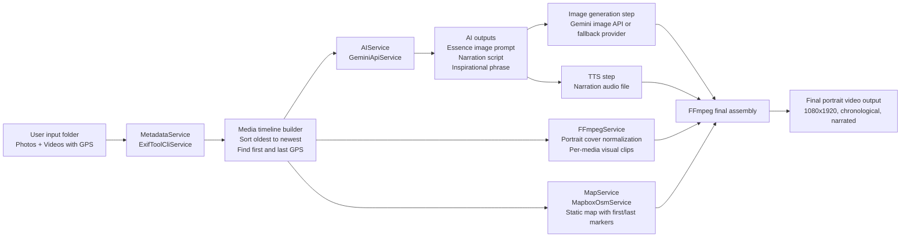

# Rooster's video creator

## Architecture plan (minimal one-way flow)



## Architecture & Design Decisions

The application manages a strictly linear, one-way pipeline prioritizing observability and separation of concerns. It delegates hard stuff to proven external tools (ExifTool, FFmpeg, Gemini, Mapbox) encapsulated behind interfaces. Processing occurs across five isolated steps: extracting metadata alongside AI prompt generation, producing per-scene TTS narrations, assembling visual portrait clips synced to that audio, mastering audio loudness norms, and appending an AI-quoted closing map sequence.

## Recommended tools for this exact project

- ExifTool: robust GPS/date extraction for mixed camera formats.
- FFmpeg: scaling, crop-to-cover portrait, concat, audio attach, loudness normalization.
- Gemini: script and phrase generation, plus first-image prompt generation.
- Mapbox Static API: deterministic map image with custom first/last pin styles.

### Run the project

From the project root, run:

```bash
./run.sh
```

### Example Usage

You can run the pipeline with multiple images to generate a narrated video with an outro map and a custom phrase overlay. Here is a simple example using three provided test images:

```bash
# Make sure to load environment first, for example:
# set -a && source .env.prod && set +a

mvn compile exec:java -Dexec.mainClass="edu.up.cg.Main" -Dexec.args="--out output-example bin/testcase/gdl2.jpg bin/testcase/cdmx.jpg bin/testcase/img-santiago.jpg"
```
